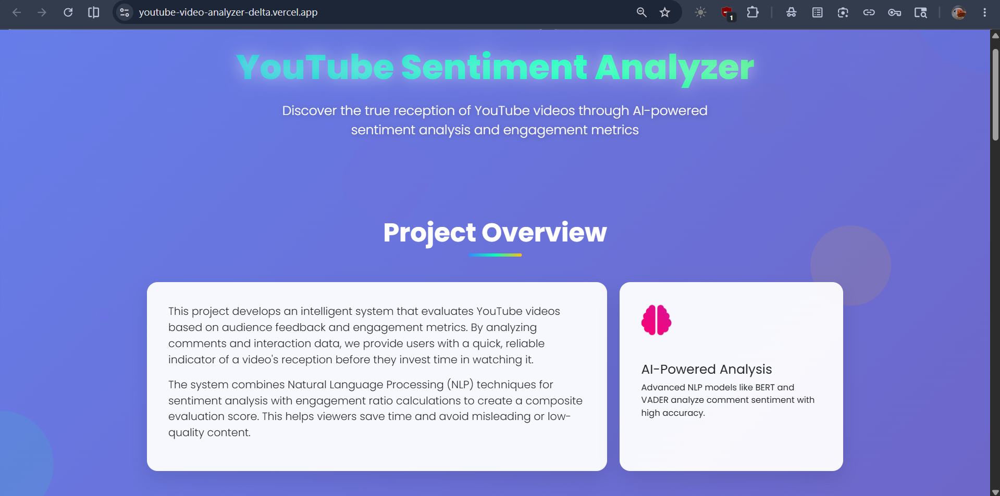
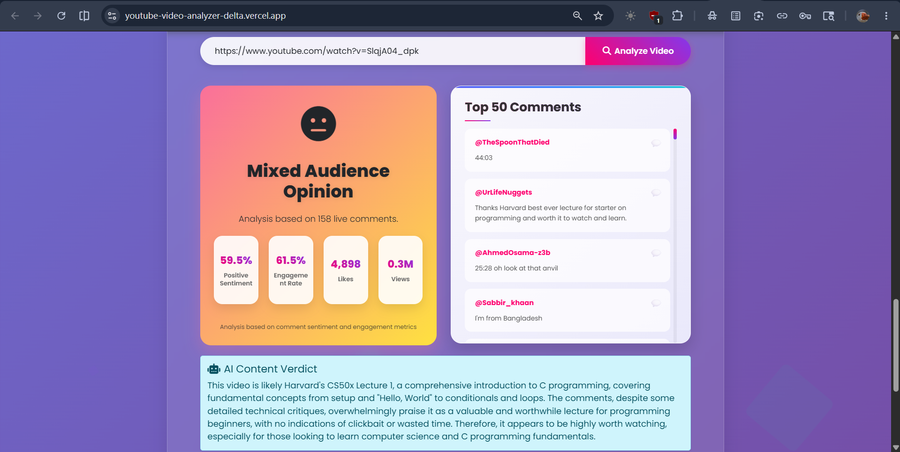

# Sentilytics

> **AI-powered YouTube sentiment intelligence**

Sentilytics helps you decide whether a YouTube video is worth watching by analyzing comment sentiment, engagement signals, and optional AI content verification.

---

## 🎯 What it does

- Reads YouTube comments and scores sentiment automatically
- Displays clean positive / neutral / negative ratios
- Estimates engagement and surface-level likes/views metrics
- Provides an AI-backed verdict for content quality when Gemini is enabled
- Ships as a polished React + Tailwind frontend with a Flask analysis backend

---

## ✨ Why it’s useful

- Quickly evaluate a video before committing time
- Detect clickbait or poor audience reaction
- Compare sentiment trends across content creators
- Build a smarter YouTube discovery MVP with real-time feedback

---

## Overview

This project evaluates YouTube videos using audience feedback and engagement signals. By combining sentiment analysis of user comments with engagement-based scoring, the platform provides an interpretable assessment of overall audience reception.

The project was developed through NLP experimentation, sentiment analysis research, and large-scale YouTube comment analytics.

---

## 🚀 Live Demo

https://youtube-video-analyzer-delta.vercel.app/

---

## Key Features

- Automated YouTube comment collection using YouTube Data API v3
- Web scraping fallback for data acquisition
- NLP-based sentiment analysis using VADER
- Comment preprocessing and filtering pipeline
- Engagement score computation
- Interactive analytics dashboard
- AI-assisted content verdict generation

---

## System Architecture


---

## Dashboard Preview

### Project Overview



### Analytics Dashboard



---

## 🚀 Tech stack

### Frontend
- React 19
- Vite
- TanStack Router
- TanStack React Query
- Tailwind CSS
- Radix UI
- Lucide icons

### Backend
- Python 3
- Flask
- Flask-CORS
- `vaderSentiment`
- `google-api-python-client`
- `youtube-transcript-api`
- `python-dotenv`
- `google-generative-ai` (Gemini)

### NLP & Analytics
- VADER Sentiment Analysis
- Text Preprocessing
- Sentiment Classification
- Engagement Analytics

---

## NLP Pipeline

1. Retrieve video metadata and comments.
2. Clean and preprocess comment text.
3. Perform sentiment analysis using VADER.
4. Calculate positive, neutral, and negative sentiment ratios.
5. Compute engagement metrics from video statistics.
6. Generate overall audience reception scores.
7. Present results through interactive dashboards.

---

## 🧩 Setup

### 1. Install dependencies

```bash
npm install
```

### 2. Setup Python backend

```bash
python -m venv .venv
source .venv/Scripts/activate
pip install -r requirements.txt
```

### 3. Configure environment variables

Create a `.env` file in the project root:

```env
YOUTUBE_API_KEY=your_youtube_api_key
GEMINI_API_KEY=your_gemini_api_key
```

> `GEMINI_API_KEY` is optional. Without it, Sentilytics will still analyze comments, but AI transcript verification will be disabled.

---

## ▶️ Run locally

Start the backend:

```bash
python app.py
```

Start the frontend:

```bash
npm run dev
```

Then open the local Vite URL shown in your terminal.

---

## 🛠️ Available scripts

- `npm run dev` — start frontend development server
- `npm run build` — build frontend for production
- `npm run preview` — preview the production build
- `npm run lint` — run ESLint checks
- `npm run format` — format code with Prettier

---

## 🔑 Environment variables

- `YOUTUBE_API_KEY` — required to fetch YouTube video metadata and comments
- `GEMINI_API_KEY` — optional AI key for transcript and commentary analysis

---

## 📁 Project structure

- `app.py` — Flask backend entrypoint and analysis API
- `src/` — React frontend source code
- `src/routes/` — app page routes and components
- `src/styles.css` — Tailwind CSS styling
- `package.json` — frontend dependencies and scripts
- `bunfig.toml` — package install guard configuration

---

## 💡 Notes

- The frontend contacts the backend at `/analyze?url=...`.
- Both frontend and backend should run together during development.
- If comments are missing or disabled, the backend returns a graceful fallback.
- Gemini AI verification requires a valid `GEMINI_API_KEY`.

---

## Research Foundation

This project was inspired by sentiment analysis research and includes implementation and evaluation of NLP-based classification workflows on large-scale YouTube comment datasets.